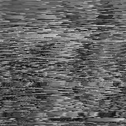
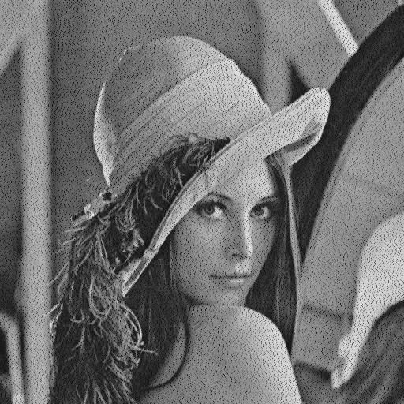
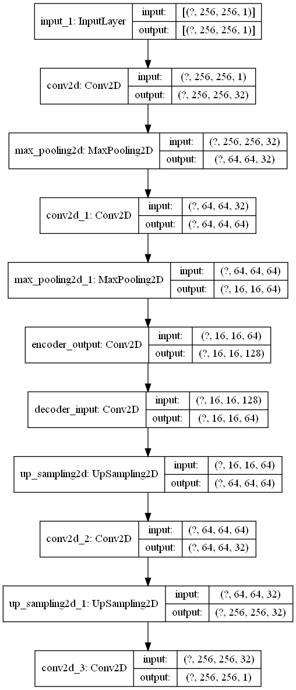
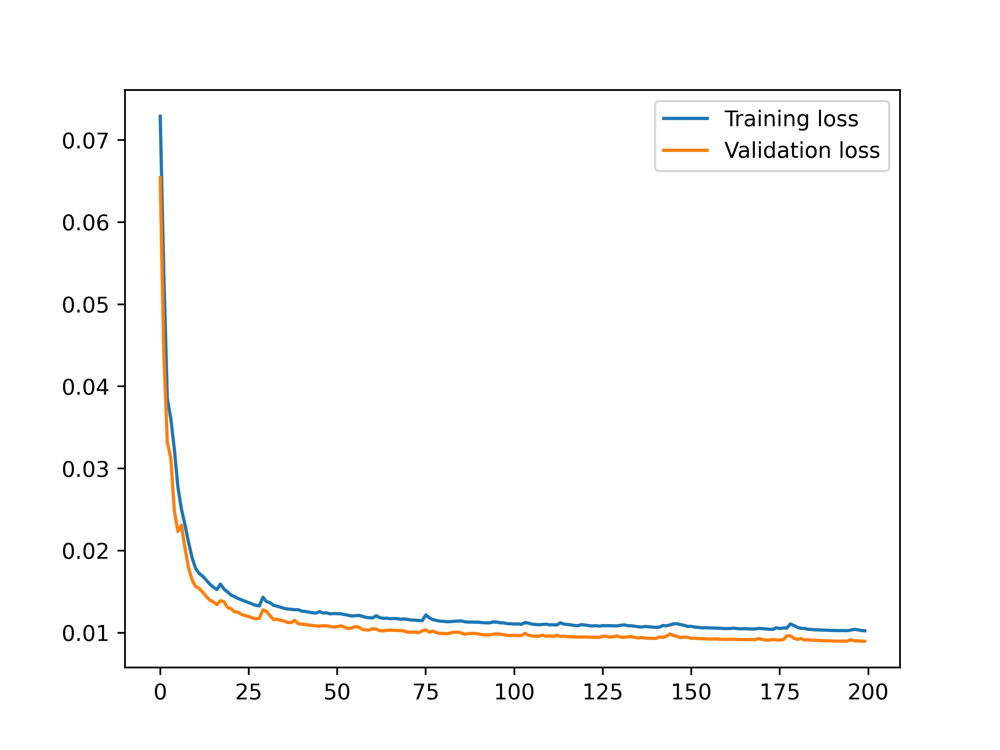
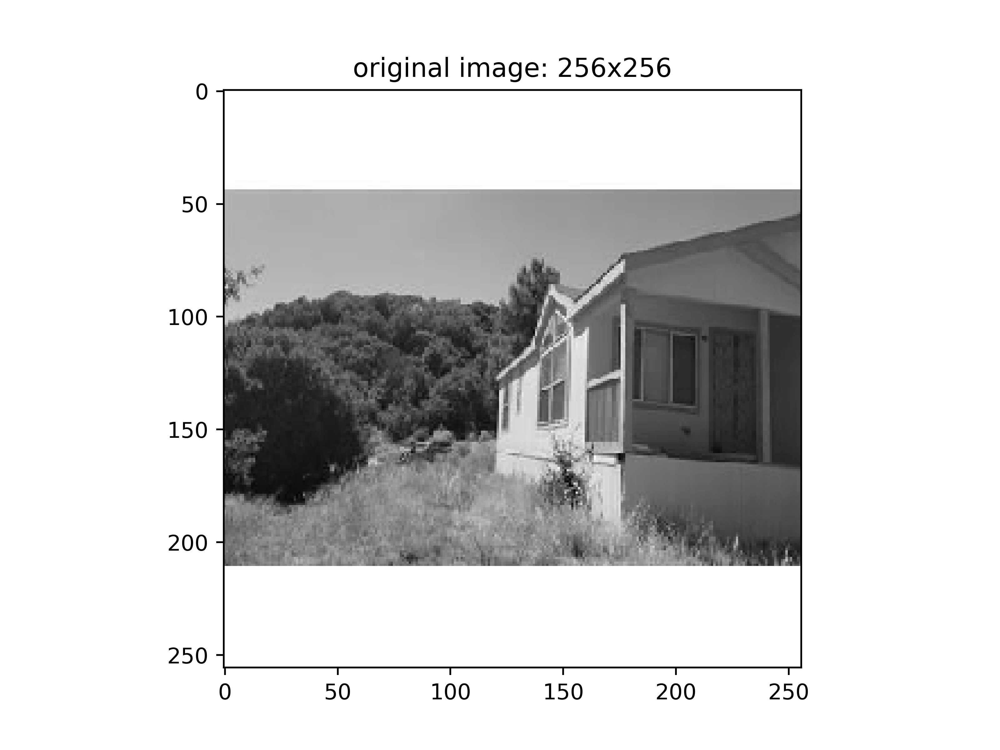
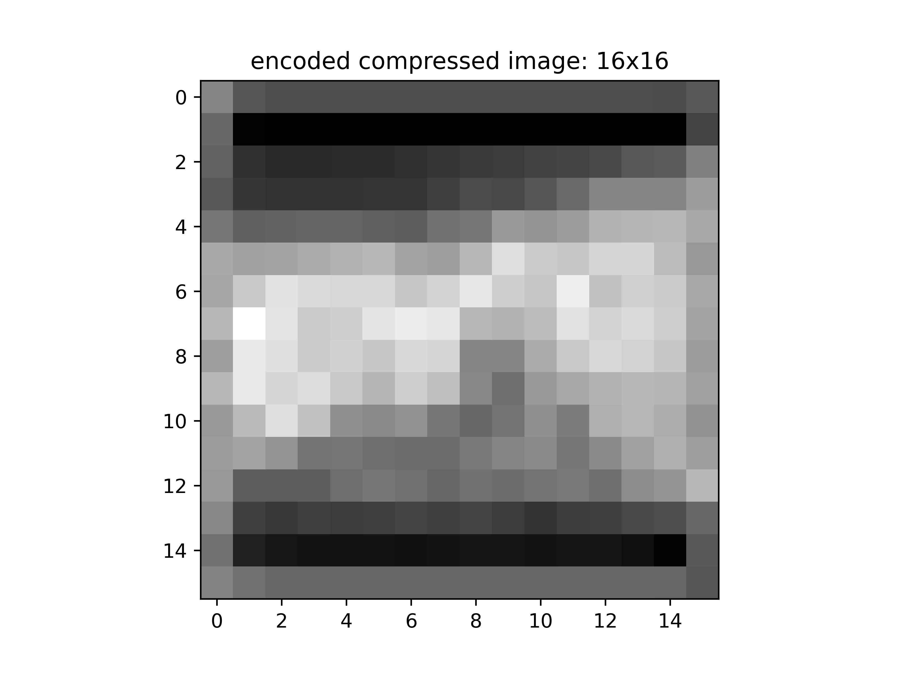
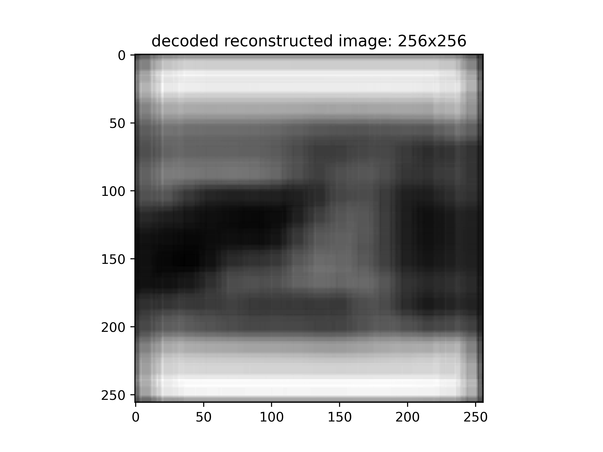
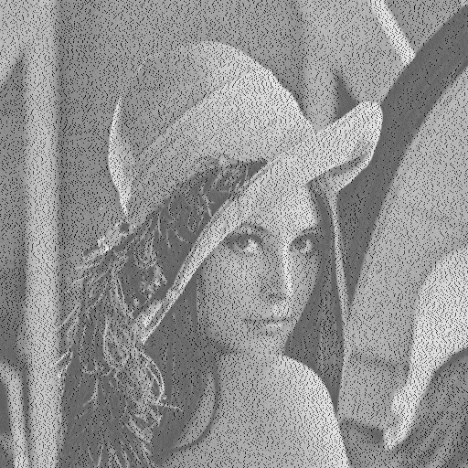
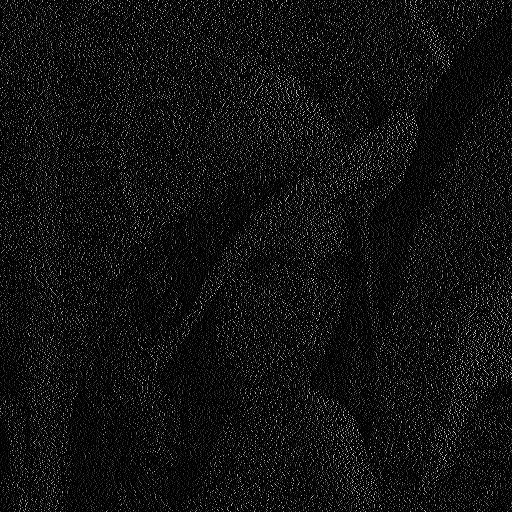

# Deep_learning_in_image_Cryptography
Deep learning in image Cryptography

## 1. Chaotic map sequence generation
```bash
python generate_chaotic_map_sequence.py
```
## 2. Shuffle and Deshuffle image

```bash 
python shuffling_deshuffling_images.py
```
 Input image


Shuffle image 



Deshuffle image


## 3. Encryption and Decryption of image using chaotic map sequence
```bash
python image_encryption_decryption.py
```
encryption of image


decryption of image



## 4. Dataset preparation 
```bash
python data_loader.py
```

## 5. Autoencoder for image encryption and decryption

```bash
python auto_encoder.py
```

Model architecture




Model training
```bash
python train.py
```
Model loss performance graph



## 6. Inferencing the model

original_vs_compressed_vs_reconstruction

```bash
python inference.py
```
original image



encoder compressed image



decoder decompressed image



## 7. Performance metrics

- Structural Similarity Index (SSIM)

```bash
python structural_similarity_SSIM_calculation.py
```
- Number of pixel change rate (NPCR)

```bash
python nnumber_of_pixel_change_rate_NPCR_comparision.py
```
- NPCR computation

image 1 output



image 2 output


- Unified Average Changing Intensity (UACI)

```bash
python unified_average_changing_intensity_UACI_comparision.py
```


## 8. Salt and paper noise
    
 ```bash
   python salt_and_pepper_noise.py
```

Noisy image

   